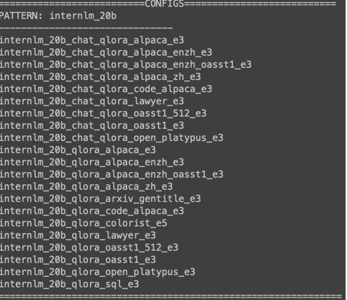

# LLM AI 相关例子 demo

每一个例子都有自己的去练习过

## 提示词工程

这是一个基于 Gradio 的 Web 应用，结合 智谱 AI GLM-4 模型，提供多个社交场景的 AI 对话服务。用户可选择不同场景（如“敬酒”、“送礼”等），获取系统提示词、示例对话，并与 AI 实时互动。

传送门：[prompt_engineering_demo](https://www.modelscope.cn/studios/deshengkong/prompt_engineering_demo_001)


## AI 聊天机器人

这个 demo 实现了一个基于 **Streamlit** 框架的 AI 聊天机器人应用

传送门：[chatbox_demo](https://www.modelscope.cn/studios/deshengkong/chatbox_demo_001)


- 初始化并维护聊天记录 (`messages`)，包括用户和助手的消息。
- 当用户提交问题时，将用户输入添加到会话历史，并显示在聊天界面上。
- 使用 `OpenAI` 客户端调用远程模型（如 Qwen2.5-7B-Instruct）进行流式响应生成。
- 将系统提示（system message）、用户输入（user query）发送给模型，并逐步接收和展示 AI 的回复。
- 使用 `Streamlit` 构建简洁的网页界面，支持 Markdown 和 HTML 渲染，展示 AI 的思考过程和最终回答。

## RAG-Langchain 版本

这个 demo 是实现一个基于**Gradio**的 RAG 模型，基于 langchain 实现。
- 选择Embedding模型（HuggingFace或ZhipuAI）
- 设置文本块大小（建议800-1000）
- 配置数据源（本地文件夹或网页URL）
- 点击”初始化数据库”开始对话

```python
# 基本组件
from langchain_community.document_loaders import DirectoryLoader
from langchain_text_splitters import RecursiveCharacterTextSplitter
from langchain_chroma import Chroma

# 核心流程
1. 加载文档
loader = DirectoryLoader(data_path, glob="*.txt")
2. 文本分割
text_splitter = RecursiveCharacterTextSplitter(
    chunk_size=chunk_size,
    chunk_overlap=200
)
3. 创建向量数据库
vectordb = Chroma.from_documents(
    documents=split_docs,
    embedding=embedding_func,
    persist_directory=persist_directory,
)
```
```bash
python run/demo_rag_langchain_onlinellm.py
```


## RAG-LlamaIndex 简单版本
```python
# 基本组件
from llama_index.core import SimpleDirectoryReader, VectorStoreIndex
from llama_index.vector_stores.faiss import FaissVectorStore

# 核心流程
1. 加载文档
documents = SimpleDirectoryReader(data_dir).load_data()

2. 创建索引
index = VectorStoreIndex.from_documents(
    documents,
    storage_context=storage_context
)

3. 创建检索器
retriever = VectorIndexRetriever(index=index)
```
```bash
python test/knowledges/llamaindex/test_RAG_zhipuai_simple.py
```


## RAG-LlamaIndex 高级版本

TODO

## Tavily - Web Search
**职责：** 测试tavily的web搜索功能
```python
tavily_client = TavilyClient(api_key=os.getenv("TAVILY_API_KEY"))
response = tavily_client.search("What is the weather in Shanghai?",max_results=10)

for url in response['results']:
    print(url['url'])
```
**Rund Demo**
```bash
python test/agents/metagpt/test_WebSearch.py    
```


## Metagpt - 智能体之简单加减
**职责：** 一个超级简单的加减功能
```python
class SimpleCalculator(Action):
    """一个简单的计算Action"""
    name: str = "SimpleCalculator"
    async def run(self, instruction: str) -> str:
        try:
            # 解析输入
            print(f"当前run ： {type(instruction)},{instruction}")
            num1, num2 = map(int, instruction.split('+'))
            result = f"{num1} + {num2} = {num1 + num2}"
            logger.info(f"计算结果: {result}")
            return result
        except Exception as e:
            error_msg = f"计算错误: {str(e)}"
            logger.error(error_msg)
            return error_msg

class CalculatorAssistant(Role):
    """计算助手角色

    ReAct 循环的模式，目前支持 REACT、BY_ORDER、PLAN_AND_ACT 3种模式，
    默认使用 REACT 模式。在 _set_react_mode 方法中有相关说明。简单来说，BY_ORDER 模式按照指定的 Action 顺序执行。
    PLAN_AND_ACT 则为一次思考后执行多个动作，即 _think -> _act -> act -> ...，
    而 REACT 模式按照 ReAct 论文中的思考——行动循环来执行，即 _think -> _act -> _think -> _act -> ...。
    """
    name: str = "Calculator"
    profile: str = "一个简单的计算助手，负责计算两个数字的和"
    
    def __init__(self, **kwargs):
        super().__init__(**kwargs)
        self.set_actions([SimpleCalculator])
        self._set_react_mode(react_mode=RoleReactMode.BY_ORDER.value)

    async def _act(self) -> Message:
        logger.info(f"{self._setting}: to do {self.rc.todo}({self.rc.todo.name})")
        todo = self.rc.todo
        print(f"当前_act ： {type(self.rc.todo)},{self.rc.todo}")

        msg = self.get_memories(k=1)[0]  # 获取最近的消息
        result = await todo.run(msg.content)
        
        msg = Message(content=result, role=self.profile, cause_by=type(todo))
        return msg

def run_example(msg: str):
    """运行单个计算示例"""
    role = CalculatorAssistant()
    logger.info(f"输入: {msg}")
    result = asyncio.run(role.run(msg))
    logger.info(f"结果: {result}")
    print("-" * 50)

def main():
    """运行多个计算示例"""
    # 基本加法示例
    run_example("5 + 3")
    # 大数加法示例
    run_example("1234 + 5678")
    # 负数加法示例
    run_example("-10 + 5")
    # 错误输入示例
    run_example("abc + def")
    # 零的加法示例
    run_example("0 + 100")
if __name__ == "__main__":
    fire.Fire(main)
```
**Rund Demo**
```bash
python test/agents/metagpt/test_metagpt_dummy.py 
```


## Metagpt - 智能体之意图识别
**职责**：分析用户输入，识别用户意图并映射到预定义场景

**主要功能**：
- 分析用户输入的自然语言文本
- 识别用户当前的意图和需求
- 将用户问题匹配到预定义的场景类型
- 输出场景标签供后续处理

**可用Actions**：
```python
  class IntentAnalyze(Action):
      """分析用户意图并映射到预定义场景标签
      使用LLM分析用户输入，返回对应的场景类型编号
      """
      name: str = "IntentAnalyze"
```
**Run demo:**
```bash
streamlit run test/agents/metagpt_agents/intentRecognition/role.py
```


## Metagpt - 智能体之场景细化
**职责**：提取和完善场景要素

**主要功能**：
- 信息抽取：从用户对话中提取场景要素
- 提问助手：对缺失的场景要素进行提问
- 场景要素验证：确保所有必要信息完整

**可用Actions**：
```python
 class sceneRefineAnalyze(Action):
      """提取场景要素
      从用户输入中提取特定场景所需的关键信息
      """
      name: str = "sceneRefineAnalyze"

  class RaiseQuestion(Action):
      """生成补充问题
      针对缺失的场景要素生成自然的追问
      """
      name: str = "RaiseQuestion"
```
**Run demo:**
```bash
 streamlit run test/agents/metagpt/sceneRefine_test_case.py 
```


## Metagpt - 智能体之回答助手
**职责**：基于场景要素生成定制化回答

**主要功能**：
- 整合场景信息和用户需求
- 生成针对性的建议和解答
- 提供详细的示例和说明

**可用Actions**：
```python
class AnswerQuestion(Action):
    """生成定制化回答
    基于完整的场景要素，生成符合用户需求的详细回答
    使用模板系统确保回答的结构性和完整性
    """
    name: str = "AnswerQuestion"
```
**Run demo:**
```bash
 streamlit run test/agents/metagpt/answerBot_test_case.py 
```


## Metagpt - 智能体之搜索助手
**职责**：通过网络搜索补充回答内容

**主要功能**：
- 查询扩展：生成相关搜索查询
- 网络搜索：使用搜索引擎获取相关信息
- 结果筛选：判断和筛选有价值的网页内容
- 内容提取：抓取和过滤网页内容
- 结果整合：将搜索结果整合到回答中

**可用Actions**：
```python
class QueryExpansion(Action):
    """生成扩展查询
    基于用户输入生成多个相关的搜索查询
    """
    name: str = "queryExpansion"

class WebSearch(Action):
    """执行网络搜索
    使用搜索引擎获取相关网页内容
    """
    name: str = "WebSearch"

class SelectResult(Action):
    """筛选搜索结果
    判断哪些搜索结果值得进一步分析
    """
    name: str = "selectResult"

class SelectFetcher(Action):
    """抓取网页内容
    获取筛选后的网页的具体内容
    """
    name: str = "selectFetcher"

class FilterSelectedResult(Action):
    """过滤和提取信息
    从网页内容中提取有价值的信息
    """
    name: str = "FilterSelectedResult"
```
**Run demo:**
```bash
 streamlit run test/agents/metagpt/searcher_test_case.py 
```
<video src="/Screen Recording 2025-07-09 at 22.32.04.mov" controls width="100%">
  您的浏览器不支持视频播放。
</video>

## XTuner FineTuning模型

**XTuner** 是一个基于 LLM 的模型微调工具，它可以帮助用户快速、轻松地微调 LLM 模型，从而提高模型的性能和效果。Xtuner 集成了 LoRA 和 QLoRA 等微调方法，让用户可以根据自身资源情况灵活选择；而 QLoRA 是 LoRA 在量化场景下的优化扩展。

**平台**：Ubuntu + Anaconda + CUDA/CUDNN + 8GB nvidia显卡

**安装**：

```bash
# 在 InternStudio 平台，则从本地 clone 一个已有 pytorch 2.0.1 的环境：
/root/share/install_conda_env_internlm_base.sh xtuner0.1.9

# 进入homoe 目录
cd ~
# 创建版本文件夹并进入，以跟随本教程
mkdir xtuner019 && cd xtuner019

# 拉取 0.1.9 的版本源码
git clone -b v0.1.9  https://github.com/InternLM/xtuner
# 无法访问github的用户请从 gitee 拉取:
# git clone -b v0.1.9 https://gitee.com/Internlm/xtuner

# 进入源码目录
cd xtuner

# 从源码安装 XTuner
pip install -e '.[all]'
```

安装完后，就开始搞搞准备工作了。（准备在 oasst1 数据集上微调 internlm-7b-chat）

```bash
# 创建一个微调 oasst1 数据集的工作路径，进入
mkdir ~/ft-oasst1 && cd ~/ft-oasst1
```

**微调：**
XTuner 提供多个开箱即用的配置文件，用户可以通过下列命令查看：

```Bash
# 列出所有内置配置
xtuner list-cfg
```
> 假如显示bash: xtuner: command not found的话可以考虑在终端输入 export PATH=$PATH:'/root/.local/bin'



拷贝一个配置文件到当前目录：
`# xtuner copy-cfg ${CONFIG_NAME} ${SAVE_PATH}`

在本案例中即：（注意最后有个英文句号，代表复制到当前路径）
```Bash
cd ~/ft-oasst1
xtuner copy-cfg internlm_chat_7b_qlora_oasst1_e3 .
```

配置文件名的解释：

> xtuner copy-cfg internlm_chat_7b_qlora_oasst1_e3 .

| 模型名   | internlm_chat_7b |
| -------- | ---------------- |
| 使用算法 | qlora            |
| 数据集   | oasst1           |
| 把数据集跑几次    | 跑3次：e3 (epoch 3 )   |

*无 chat比如 `internlm-7b` 代表是基座(base)模型

**模型下载：**
> 由于下载模型很慢，用教学平台的同学可以直接复制模型。

```Bash
ln -s /share/temp/model_repos/internlm-chat-7b ~/ft-oasst1/
```
以上是通过软链的方式，将模型文件挂载到家目录下，优势是：
1. 节省拷贝时间，无需等待
2. 节省用户开发机存储空间
> 当然，也可以用 `cp -r /share/temp/model_repos/internlm-chat-7b ~/ft-oasst1/` 进行数据拷贝。

> 以下是自己下载模型的步骤。

不用 xtuner 默认的`从 huggingface 拉取模型`，而是提前从 ~~OpenXLab~~ ModelScope 下载模型到本地

```Bash
# 创建一个目录，放模型文件，防止散落一地
mkdir ~/ft-oasst1/internlm-chat-7b

# 装一下拉取模型文件要用的库
pip install modelscope

# 从 modelscope 下载下载模型文件
cd ~/ft-oasst1
apt install git git-lfs -y
git lfs install
git lfs clone https://modelscope.cn/Shanghai_AI_Laboratory/internlm-chat-7b.git -b v1.0.3
```

**数据集下载：**
> https://huggingface.co/datasets/timdettmers/openassistant-guanaco/tree/main

由于 huggingface 网络问题，咱们已经给大家提前下载好了，复制到正确位置即可：

```bash
cd ~/ft-oasst1
# ...-guanaco 后面有个空格和英文句号啊
cp -r /root/share/temp/datasets/openassistant-guanaco .
```

此时，当前路径的文件应该长这样：

```bash
|-- internlm-chat-7b
|   |-- README.md
|   |-- config.json
|   |-- configuration.json
|   |-- configuration_internlm.py
|   |-- generation_config.json
|   |-- modeling_internlm.py
|   |-- pytorch_model-00001-of-00008.bin
|   |-- pytorch_model-00002-of-00008.bin
|   |-- pytorch_model-00003-of-00008.bin
|   |-- pytorch_model-00004-of-00008.bin
|   |-- pytorch_model-00005-of-00008.bin
|   |-- pytorch_model-00006-of-00008.bin
|   |-- pytorch_model-00007-of-00008.bin
|   |-- pytorch_model-00008-of-00008.bin
|   |-- pytorch_model.bin.index.json
|   |-- special_tokens_map.json
|   |-- tokenization_internlm.py
|   |-- tokenizer.model
|   `-- tokenizer_config.json
|-- internlm_chat_7b_qlora_oasst1_e3_copy.py
`-- openassistant-guanaco
    |-- openassistant_best_replies_eval.jsonl
    `-- openassistant_best_replies_train.jsonl
```

**修改配置文件：**

修改其中的模型和数据集为 本地路径

```bash
cd ~/ft-oasst1
vim internlm_chat_7b_qlora_oasst1_e3_copy.py
```
> 在vim界面完成修改后，请输入:wq退出。假如认为改错了可以用:q!退出且不保存。当然我们也可以考虑打开python文件直接修改，但注意修改完后需要按下Ctrl+S进行保存。

减号代表要删除的行，加号代表要增加的行。
```diff
# 修改模型为本地路径
- pretrained_model_name_or_path = 'internlm/internlm-chat-7b'
+ pretrained_model_name_or_path = './internlm-chat-7b'

# 修改训练数据集为本地路径
- data_path = 'timdettmers/openassistant-guanaco'
+ data_path = './openassistant-guanaco'
```

**常用超参**

| 参数名 | 解释 |
| ------------------- | ------------------------------------------------------ |
| **data_path**       | 数据路径或 HuggingFace 仓库名                          |
| max_length          | 单条数据最大 Token 数，超过则截断                      |
| pack_to_max_length  | 是否将多条短数据拼接到 max_length，提高 GPU 利用率     |
| accumulative_counts | 梯度累积，每多少次 backward 更新一次参数               |
| evaluation_inputs   | 训练过程中，会根据给定的问题进行推理，便于观测训练状态 |
| evaluation_freq     | Evaluation 的评测间隔 iter 数                          |
| ...... | ...... |

> 如果想把显卡的现存吃满，充分利用显卡资源，可以将 `max_length` 和 `batch_size` 这两个参数调大。

开始微调

**训练：**

xtuner train ${CONFIG_NAME_OR_PATH}

**也可以增加 deepspeed 进行训练加速：**

xtuner train ${CONFIG_NAME_OR_PATH} --deepspeed deepspeed_zero2


例如，我们可以利用 QLoRA 算法在 oasst1 数据集上微调 InternLM-7B：

```Bash
# 单卡
## 用刚才改好的config文件训练
xtuner train ./internlm_chat_7b_qlora_oasst1_e3_copy.py

# 多卡
NPROC_PER_NODE=${GPU_NUM} xtuner train ./internlm_chat_7b_qlora_oasst1_e3_copy.py

# 若要开启 deepspeed 加速，增加 --deepspeed deepspeed_zero2 即可
```

> 微调得到的 PTH 模型文件和其他杂七杂八的文件都默认在当前的 `./work_dirs` 中。

跑完训练后，当前路径应该长这样：
```Bash
|-- internlm-chat-7b
|-- internlm_chat_7b_qlora_oasst1_e3_copy.py
|-- openassistant-guanaco
|   |-- openassistant_best_replies_eval.jsonl
|   `-- openassistant_best_replies_train.jsonl
`-- work_dirs
    `-- internlm_chat_7b_qlora_oasst1_e3_copy
        |-- 20231101_152923
        |   |-- 20231101_152923.log
        |   `-- vis_data
        |       |-- 20231101_152923.json
        |       |-- config.py
        |       `-- scalars.json
        |-- epoch_1.pth
        |-- epoch_2.pth
        |-- epoch_3.pth
        |-- internlm_chat_7b_qlora_oasst1_e3_copy.py
        `-- last_checkpoint
```

将得到的 PTH 模型转换为 HuggingFace 模型，**即：生成 Adapter 文件夹**

`xtuner convert pth_to_hf ${CONFIG_NAME_OR_PATH} ${PTH_file_dir} ${SAVE_PATH}`

在本示例中，为：
```bash
mkdir hf
export MKL_SERVICE_FORCE_INTEL=1
export MKL_THREADING_LAYER=GNU
xtuner convert pth_to_hf ./internlm_chat_7b_qlora_oasst1_e3_copy.py ./work_dirs/internlm_chat_7b_qlora_oasst1_e3_copy/epoch_1.pth ./hf
```
此时，路径中应该长这样：

```Bash
|-- internlm-chat-7b
|-- internlm_chat_7b_qlora_oasst1_e3_copy.py
|-- openassistant-guanaco
|   |-- openassistant_best_replies_eval.jsonl
|   `-- openassistant_best_replies_train.jsonl
|-- hf
|   |-- README.md
|   |-- adapter_config.json
|   |-- adapter_model.bin
|   `-- xtuner_config.py
`-- work_dirs
    `-- internlm_chat_7b_qlora_oasst1_e3_copy
        |-- 20231101_152923
        |   |-- 20231101_152923.log
        |   `-- vis_data
        |       |-- 20231101_152923.json
        |       |-- config.py
        |       `-- scalars.json
        |-- epoch_1.pth
        |-- epoch_2.pth
        |-- epoch_3.pth
        |-- internlm_chat_7b_qlora_oasst1_e3_copy.py
        `-- last_checkpoint
```

<span style="color: red;">**此时，hf 文件夹即为我们平时所理解的所谓 “LoRA 模型文件”**</span>

> 可以简单理解：LoRA 模型文件 = Adapter


**部署与测试：**

将 HuggingFace adapter 合并到大语言模型：

```Bash
xtuner convert merge ./internlm-chat-7b ./hf ./merged --max-shard-size 2GB
# xtuner convert merge \
#     ${NAME_OR_PATH_TO_LLM} \
#     ${NAME_OR_PATH_TO_ADAPTER} \
#     ${SAVE_PATH} \
#     --max-shard-size 2GB
```

与合并后的模型对话：
```Bash
# 加载 Adapter 模型对话（Float 16）
xtuner chat ./merged --prompt-template internlm_chat

# 4 bit 量化加载
# xtuner chat ./merged --bits 4 --prompt-template internlm_chat
```

Demo

- 修改 `cli_demo.py` 中的模型路径
```diff
- model_name_or_path = "/root/model/Shanghai_AI_Laboratory/internlm-chat-7b"
+ model_name_or_path = "merged"
```
- 运行 `cli_demo.py` 以目测微调效果
```bash
python ./cli_demo.py
```

**效果：**

| 微调前 | 微调后 |
| --- | --- |
| TODO | TODO |

**`xtuner chat`** **的启动参数**

| 启动参数              | 干哈滴                                                       |
| --------------------- | ------------------------------------------------------------ |
| **--prompt-template** | 指定对话模板                                                 |
| --system              | 指定SYSTEM文本                                               |
| --system-template     | 指定SYSTEM模板                                               |
| -**-bits**            | LLM位数                                                      |
| --bot-name            | bot名称                                                      |
| --with-plugins        | 指定要使用的插件                                             |
| **--no-streamer**     | 是否启用流式传输                                             |
| **--lagent**          | 是否使用lagent                                               |
| --command-stop-word   | 命令停止词                                                   |
| --answer-stop-word    | 回答停止词                                                   |
| --offload-folder      | 存放模型权重的文件夹（或者已经卸载模型权重的文件夹）         |
| --max-new-tokens      | 生成文本中允许的最大 `token` 数量                                |
| **--temperature**     | 温度值                                                       |
| --top-k               | 保留用于顶k筛选的最高概率词汇标记数                          |
| --top-p               | 如果设置为小于1的浮点数，仅保留概率相加高于 `top_p` 的最小一组最有可能的标记 |
| --seed                | 用于可重现文本生成的随机种子                                 |
