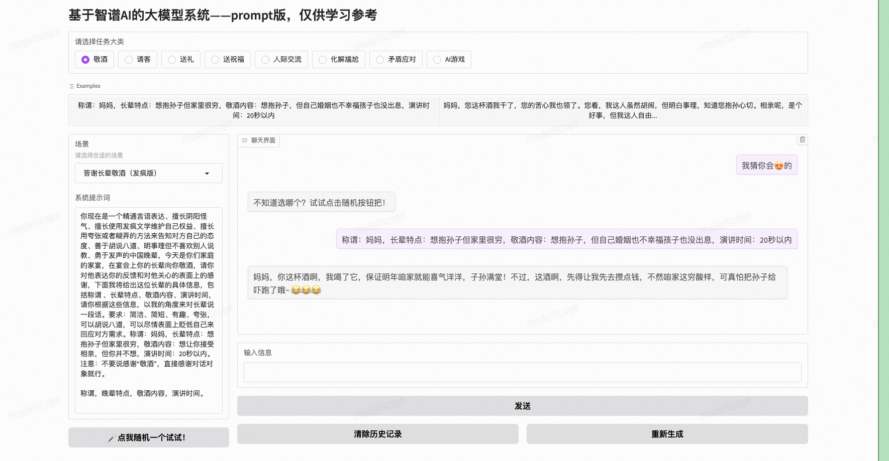
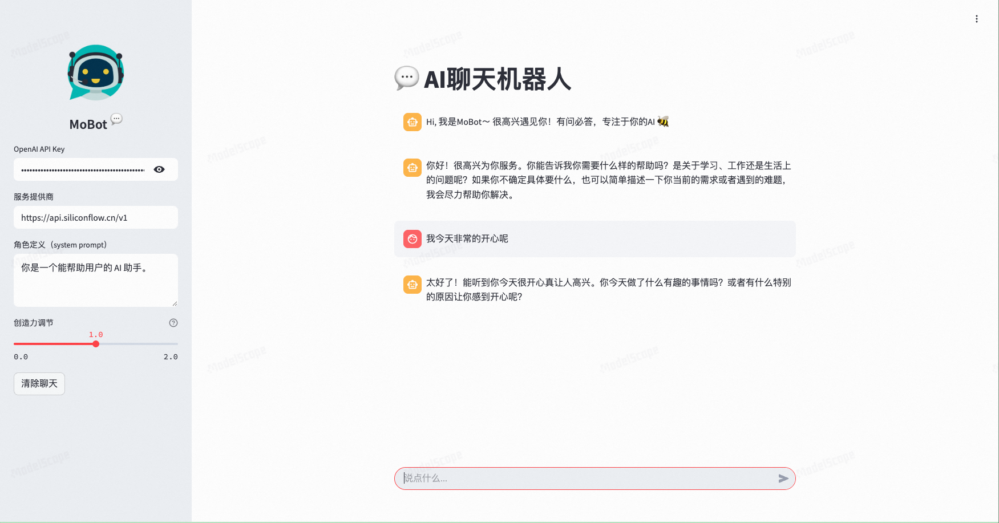
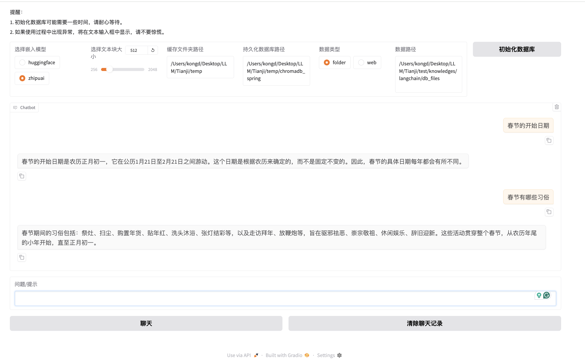
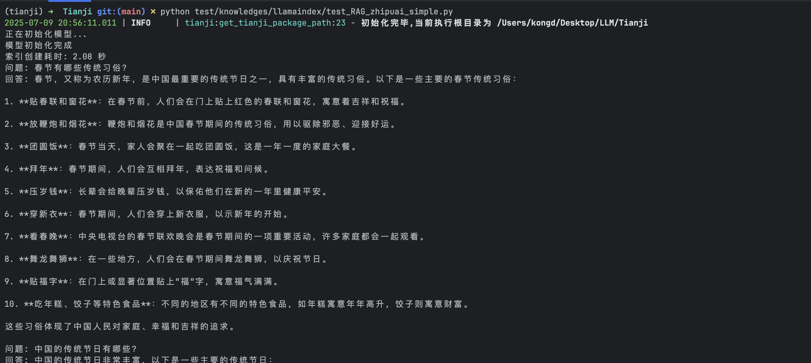
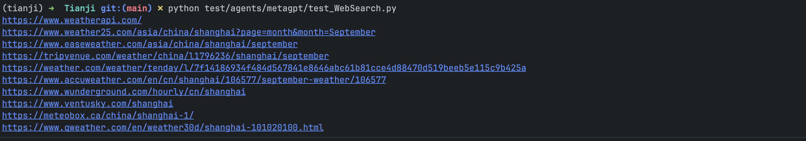
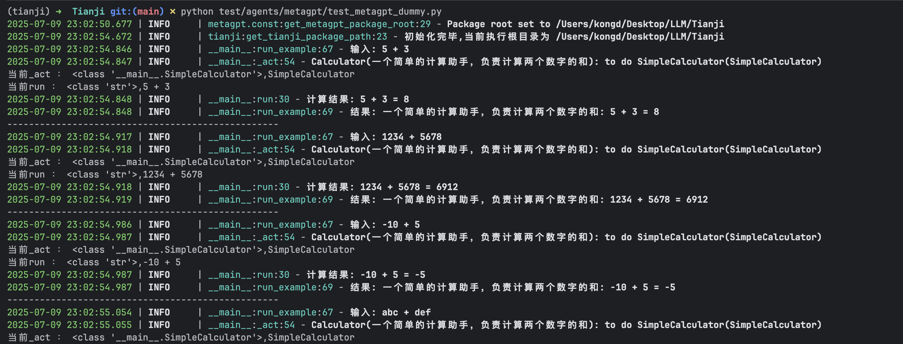
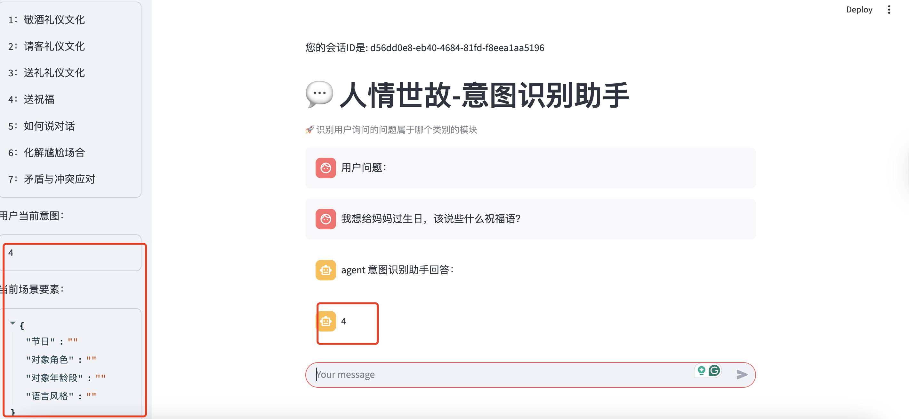
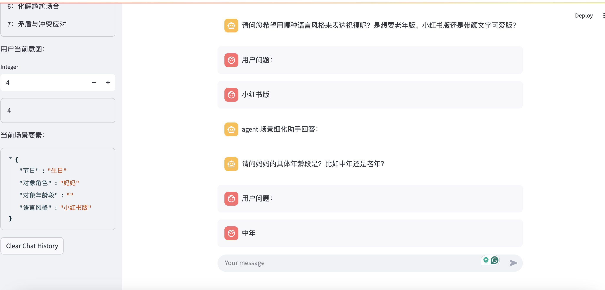
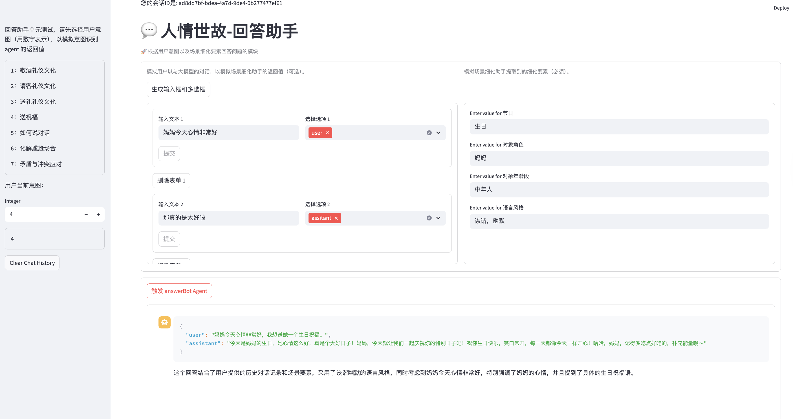

# LLM AI 相关例子 demo

每一个例子都有自己的去练习过

## 提示词工程

这是一个基于 Gradio 的 Web 应用，结合 智谱 AI GLM-4 模型，提供多个社交场景的 AI 对话服务。用户可选择不同场景（如“敬酒”、“送礼”等），获取系统提示词、示例对话，并与 AI 实时互动。

传送门：[prompt_engineering_demo](https://www.modelscope.cn/studios/deshengkong/prompt_engineering_demo_001)


## AI 聊天机器人

这个 demo 实现了一个基于 **Streamlit** 框架的 AI 聊天机器人应用

传送门：[chatbox_demo](https://www.modelscope.cn/studios/deshengkong/chatbox_demo_001)


- 初始化并维护聊天记录 (`messages`)，包括用户和助手的消息。
- 当用户提交问题时，将用户输入添加到会话历史，并显示在聊天界面上。
- 使用 `OpenAI` 客户端调用远程模型（如 Qwen2.5-7B-Instruct）进行流式响应生成。
- 将系统提示（system message）、用户输入（user query）发送给模型，并逐步接收和展示 AI 的回复。
- 使用 `Streamlit` 构建简洁的网页界面，支持 Markdown 和 HTML 渲染，展示 AI 的思考过程和最终回答。

## RAG-Langchain 版本

这个 demo 是实现一个基于**Gradio**的 RAG 模型，基于 langchain 实现。
- 选择Embedding模型（HuggingFace或ZhipuAI）
- 设置文本块大小（建议800-1000）
- 配置数据源（本地文件夹或网页URL）
- 点击”初始化数据库”开始对话

```python
# 基本组件
from langchain_community.document_loaders import DirectoryLoader
from langchain_text_splitters import RecursiveCharacterTextSplitter
from langchain_chroma import Chroma

# 核心流程
1. 加载文档
loader = DirectoryLoader(data_path, glob="*.txt")
2. 文本分割
text_splitter = RecursiveCharacterTextSplitter(
    chunk_size=chunk_size,
    chunk_overlap=200
)
3. 创建向量数据库
vectordb = Chroma.from_documents(
    documents=split_docs,
    embedding=embedding_func,
    persist_directory=persist_directory,
)
```
```bash
python run/demo_rag_langchain_onlinellm.py
```


## RAG-LlamaIndex 简单版本
```python
# 基本组件
from llama_index.core import SimpleDirectoryReader, VectorStoreIndex
from llama_index.vector_stores.faiss import FaissVectorStore

# 核心流程
1. 加载文档
documents = SimpleDirectoryReader(data_dir).load_data()

2. 创建索引
index = VectorStoreIndex.from_documents(
    documents,
    storage_context=storage_context
)

3. 创建检索器
retriever = VectorIndexRetriever(index=index)
```
```bash
python test/knowledges/llamaindex/test_RAG_zhipuai_simple.py
```


## RAG-LlamaIndex 高级版本

TODO

## Tavily - Web Search
**职责：** 测试tavily的web搜索功能
```python
tavily_client = TavilyClient(api_key=os.getenv("TAVILY_API_KEY"))
response = tavily_client.search("What is the weather in Shanghai?",max_results=10)

for url in response['results']:
    print(url['url'])
```
**Rund Demo**
```bash
python test/agents/metagpt/test_WebSearch.py    
```


## Metagpt - 智能体之简单加减
**职责：** 一个超级简单的加减功能
```python
class SimpleCalculator(Action):
    """一个简单的计算Action"""
    name: str = "SimpleCalculator"
    async def run(self, instruction: str) -> str:
        try:
            # 解析输入
            print(f"当前run ： {type(instruction)},{instruction}")
            num1, num2 = map(int, instruction.split('+'))
            result = f"{num1} + {num2} = {num1 + num2}"
            logger.info(f"计算结果: {result}")
            return result
        except Exception as e:
            error_msg = f"计算错误: {str(e)}"
            logger.error(error_msg)
            return error_msg

class CalculatorAssistant(Role):
    """计算助手角色

    ReAct 循环的模式，目前支持 REACT、BY_ORDER、PLAN_AND_ACT 3种模式，
    默认使用 REACT 模式。在 _set_react_mode 方法中有相关说明。简单来说，BY_ORDER 模式按照指定的 Action 顺序执行。
    PLAN_AND_ACT 则为一次思考后执行多个动作，即 _think -> _act -> act -> ...，
    而 REACT 模式按照 ReAct 论文中的思考——行动循环来执行，即 _think -> _act -> _think -> _act -> ...。
    """
    name: str = "Calculator"
    profile: str = "一个简单的计算助手，负责计算两个数字的和"
    
    def __init__(self, **kwargs):
        super().__init__(**kwargs)
        self.set_actions([SimpleCalculator])
        self._set_react_mode(react_mode=RoleReactMode.BY_ORDER.value)

    async def _act(self) -> Message:
        logger.info(f"{self._setting}: to do {self.rc.todo}({self.rc.todo.name})")
        todo = self.rc.todo
        print(f"当前_act ： {type(self.rc.todo)},{self.rc.todo}")

        msg = self.get_memories(k=1)[0]  # 获取最近的消息
        result = await todo.run(msg.content)
        
        msg = Message(content=result, role=self.profile, cause_by=type(todo))
        return msg

def run_example(msg: str):
    """运行单个计算示例"""
    role = CalculatorAssistant()
    logger.info(f"输入: {msg}")
    result = asyncio.run(role.run(msg))
    logger.info(f"结果: {result}")
    print("-" * 50)

def main():
    """运行多个计算示例"""
    # 基本加法示例
    run_example("5 + 3")
    # 大数加法示例
    run_example("1234 + 5678")
    # 负数加法示例
    run_example("-10 + 5")
    # 错误输入示例
    run_example("abc + def")
    # 零的加法示例
    run_example("0 + 100")
if __name__ == "__main__":
    fire.Fire(main)
```
**Rund Demo**
```bash
python test/agents/metagpt/test_metagpt_dummy.py 
```


## Metagpt - 智能体之意图识别
**职责**：分析用户输入，识别用户意图并映射到预定义场景

**主要功能**：
- 分析用户输入的自然语言文本
- 识别用户当前的意图和需求
- 将用户问题匹配到预定义的场景类型
- 输出场景标签供后续处理

**可用Actions**：
```python
  class IntentAnalyze(Action):
      """分析用户意图并映射到预定义场景标签
      使用LLM分析用户输入，返回对应的场景类型编号
      """
      name: str = "IntentAnalyze"
```
**Run demo:**
```bash
streamlit run test/agents/metagpt_agents/intentRecognition/role.py
```


## Metagpt - 智能体之场景细化
**职责**：提取和完善场景要素

**主要功能**：
- 信息抽取：从用户对话中提取场景要素
- 提问助手：对缺失的场景要素进行提问
- 场景要素验证：确保所有必要信息完整

**可用Actions**：
```python
 class sceneRefineAnalyze(Action):
      """提取场景要素
      从用户输入中提取特定场景所需的关键信息
      """
      name: str = "sceneRefineAnalyze"

  class RaiseQuestion(Action):
      """生成补充问题
      针对缺失的场景要素生成自然的追问
      """
      name: str = "RaiseQuestion"
```
**Run demo:**
```bash
 streamlit run test/agents/metagpt/sceneRefine_test_case.py 
```


## Metagpt - 智能体之回答助手
**职责**：基于场景要素生成定制化回答

**主要功能**：
- 整合场景信息和用户需求
- 生成针对性的建议和解答
- 提供详细的示例和说明

**可用Actions**：
```python
class AnswerQuestion(Action):
    """生成定制化回答
    基于完整的场景要素，生成符合用户需求的详细回答
    使用模板系统确保回答的结构性和完整性
    """
    name: str = "AnswerQuestion"
```
**Run demo:**
```bash
 streamlit run test/agents/metagpt/answerBot_test_case.py 
```


## Metagpt - 智能体之搜索助手
**职责**：通过网络搜索补充回答内容

**主要功能**：
- 查询扩展：生成相关搜索查询
- 网络搜索：使用搜索引擎获取相关信息
- 结果筛选：判断和筛选有价值的网页内容
- 内容提取：抓取和过滤网页内容
- 结果整合：将搜索结果整合到回答中

**可用Actions**：
```python
class QueryExpansion(Action):
    """生成扩展查询
    基于用户输入生成多个相关的搜索查询
    """
    name: str = "queryExpansion"

class WebSearch(Action):
    """执行网络搜索
    使用搜索引擎获取相关网页内容
    """
    name: str = "WebSearch"

class SelectResult(Action):
    """筛选搜索结果
    判断哪些搜索结果值得进一步分析
    """
    name: str = "selectResult"

class SelectFetcher(Action):
    """抓取网页内容
    获取筛选后的网页的具体内容
    """
    name: str = "selectFetcher"

class FilterSelectedResult(Action):
    """过滤和提取信息
    从网页内容中提取有价值的信息
    """
    name: str = "FilterSelectedResult"
```
**Run demo:**
```bash
 streamlit run test/agents/metagpt/searcher_test_case.py 
```
<video src="/Screen Recording 2025-07-09 at 22.32.04.mov" controls width="100%">
  您的浏览器不支持视频播放。
</video>
